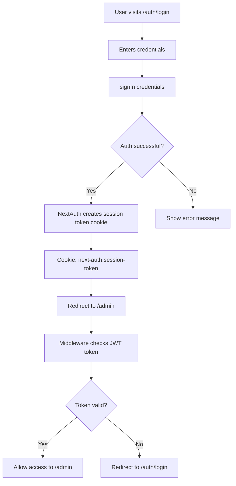

# Production Build Fixes & Troubleshooting Guide

This document covers critical fixes applied to resolve production build issues in the BB Fireworks application running on Next.js 15.5.5 with Turbopack.

## Table of Contents

1. [Lucide-React HMR/Module Error Fix](#lucide-react-hmrmodule-error-fix)
2. [NextAuth Authentication Issues in Production](#nextauth-authentication-issues-in-production)
3. [Troubleshooting Guide](#troubleshooting-guide)
4. [Testing Checklist](#testing-checklist)

---

## Lucide-React HMR/Module Error Fix

### Problem Description

**Error Message:**
```
Module [project]/node_modules/lucide-react/dist/esm/icons/house.js [app-client] (ecmascript)
<export default as Home> was instantiated because it was required from module
[project]/src/components/Breadcrumbs.tsx [app-client] (ecmascript), but the module factory
is not available. It might have been deleted in an HMR update.
```

**Symptoms:**
- Error appears after logout/sign out on marketplace/home page
- Works in dev mode (`npm run dev`)
- Fails in production mode (`npm run build && npm start`)
- Console shows lucide-react module instantiation errors

### Root Cause

1. **Server Component Importing Client-Only Icons**: The `layout.tsx` (server component) was directly importing lucide-react icons
2. **Turbopack Module Resolution Issues**: Next.js 15.5.5 with Turbopack has issues resolving lucide-react ESM modules in production builds when imported in server components
3. **HMR Cache Corruption**: Hot Module Replacement cache issues during production builds

### Solution

#### Step 1: Extract Icon Usage to Client Components

**Problem File:** `src/app/(public)/layout.tsx` (Server Component)
```typescript
// ❌ BAD: Server component importing lucide-react directly
import { Store } from "lucide-react";

export default function PublicLayout({ children }) {
  return (
    <div>
      <Store size={18} /> {/* Using icon directly */}
    </div>
  );
}
```

**Solution:** Create dedicated client component

**New File:** `src/components/MarketplaceLink.tsx`
```typescript
"use client";

import Link from "next/link";
import { Store } from "lucide-react";

export function MarketplaceLink() {
  return (
    <Link
      href="/"
      className="btn flex items-center gap-1.5"
      aria-label="Marketplace"
    >
      <Store size={18} />
    </Link>
  );
}
```

**Updated File:** `src/app/(public)/layout.tsx`
```typescript
// ✅ GOOD: Server component importing client component wrapper
import { MarketplaceLink } from "@/components/MarketplaceLink";

export default function PublicLayout({ children }) {
  return (
    <div>
      <MarketplaceLink /> {/* Client component wraps the icon */}
    </div>
  );
}
```

#### Step 2: Clear Build Cache

```bash
# Remove corrupted build cache
rm -rf .next

# Rebuild
npm run build
```

### Files Modified

1. **Created:** `src/components/MarketplaceLink.tsx`
2. **Modified:** `src/app/(public)/layout.tsx`

### Prevention Tips

- ✅ **DO:** Import lucide-react icons only in `"use client"` components
- ✅ **DO:** Create wrapper client components for icons used in server components
- ✅ **DO:** Clear `.next` directory when encountering module resolution errors
- ❌ **DON'T:** Import lucide-react directly in server components
- ❌ **DON'T:** Mix server and client component boundaries with icon imports

---

## NextAuth Authentication Issues in Production

### Problem Description

**Symptoms:**
- Login succeeds but doesn't redirect to `/admin`
- After navigation to marketplace, sign-in button shows instead of sign-out
- Admin button redirects to login page even after successful authentication
- Sign-out button doesn't work
- **Works in dev mode but fails in production mode**

### Root Cause

**Cookie Configuration Issues:**

1. **Secure Cookie on Non-HTTPS**: Production config used `secure: true` which blocks cookies on `http://localhost`
2. **__Secure- Cookie Prefix**: Browser requirement - `__Secure-` prefix only works on HTTPS connections
3. **Missing NEXTAUTH_URL**: NextAuth couldn't determine the base URL for callbacks
4. **Conditional Logic Complexity**: Complex conditional logic for cookie names caused inconsistencies

### Solution

#### Step 1: Fix Cookie Configuration

**Problem Configuration:** `src/auth.config.ts`
```typescript
// ❌ BAD: Conditional secure cookies that fail on localhost
cookies: {
  sessionToken: {
    name: process.env.NODE_ENV === "production"
      ? "__Secure-next-auth.session-token"  // ❌ Requires HTTPS
      : "next-auth.session-token",
    options: {
      secure: process.env.NODE_ENV === "production"  // ❌ Blocks on localhost
    }
  }
}
```

**Fixed Configuration:** `src/auth.config.ts`
```typescript
// ✅ GOOD: Simple cookie config that works on localhost
cookies: {
  sessionToken: {
    name: "next-auth.session-token",  // ✅ No __Secure- prefix
    options: {
      httpOnly: true,
      sameSite: "lax",
      path: "/",
      secure: false  // ✅ Set to true only for HTTPS domains
    }
  }
}
```

#### Step 2: Configure Environment Variables

**File:** `.env` (Development)
```bash
# Base URL for NextAuth
NEXTAUTH_URL="http://localhost:3000"

# Secrets (NextAuth v4 needs both)
NEXTAUTH_SECRET="dev-secret"
AUTH_SECRET="dev-secret"

# Trust host
AUTH_TRUST_HOST="true"
```

**File:** `.env.prod` (Production - Local Testing)
```bash
# Base URL for NextAuth (localhost for local production testing)
NEXTAUTH_URL="http://localhost:3000"

# Secrets (use strong random values)
NEXTAUTH_SECRET="JOXfl7TJl4kdECs7Rfhaa1CZsUgr4WRx+B9yZV3x+I8="
AUTH_SECRET="JOXfl7TJl4kdECs7Rfhaa1CZsUgr4WRx+B9yZV3x+I8="

AUTH_TRUST_HOST="true"
```

**File:** `.env.prod` (Production - Live Deployment)
```bash
# Base URL for NextAuth (your actual domain)
NEXTAUTH_URL="https://yourdomain.com"

# Secrets
NEXTAUTH_SECRET="your-production-secret-here"
AUTH_SECRET="your-production-secret-here"

AUTH_TRUST_HOST="true"
```

#### Step 3: Update Cookie Settings for HTTPS Deployment

When deploying to production with HTTPS, update `src/auth.config.ts`:

```typescript
cookies: {
  sessionToken: {
    name: "next-auth.session-token",
    options: {
      httpOnly: true,
      sameSite: "lax",
      path: "/",
      secure: true  // ✅ Change to true for HTTPS
    }
  }
}
```

#### Step 4: Rebuild and Test

```bash
# Clear cache
rm -rf .next

# Rebuild
npm run build

# Kill old servers
pkill -9 -f "node.*next"

# Start production server
npm start
```

### Files Modified

1. **Modified:** `src/auth.config.ts` - Cookie configuration
2. **Modified:** `.env` - Added NEXTAUTH_URL and AUTH_SECRET
3. **Modified:** `.env.prod` - Added NEXTAUTH_URL with documentation

### Complete Authentication Flow



### Cookie Requirements by Environment

| Environment | URL | Secure Flag | Cookie Name | Works? |
|-------------|-----|-------------|-------------|--------|
| Dev (localhost) | http://localhost:3000 | `false` | `next-auth.session-token` | ✅ Yes |
| Prod Testing (localhost) | http://localhost:3000 | `false` | `next-auth.session-token` | ✅ Yes |
| Prod Testing (localhost) | http://localhost:3000 | `true` | `__Secure-next-auth.session-token` | ❌ No |
| Live Production | https://yourdomain.com | `true` | `next-auth.session-token` | ✅ Yes |
| Live Production | https://yourdomain.com | `true` | `__Secure-next-auth.session-token` | ✅ Yes |

---

## Hydration Mismatch Errors

### Problem Description

**Error Message:**
```
Hydration failed because the server rendered HTML didn't match the client.
Warning: Prop `className` did not match. Server: "..." Client: "..."
```

**Symptoms:**
- Console warnings about hydration mismatches
- className differences between server and client
- Browser extensions injecting attributes (e.g., `fdprocessedid`)
- Form elements showing hydration warnings

### Root Cause

**The core issue:** React expects the client's **first render** to match the server HTML exactly. When they differ, you get hydration mismatches—and React won't patch them up automatically.

Common causes:

1. **Browser Extensions (Most Common):** Extensions like McAfee, VPNs, ColorZilla, password managers inject attributes (`fdprocessedid`, `cz-shortcut-listen`, etc.) **before** React hydrates, making client HTML differ from server HTML
2. **URL Updates During Hydration:** Pushing to the router during the initial render can trigger a re-render that no longer matches the server DOM
3. **Dynamic Content Without Guard:** Rendering different content on server vs client without proper mounting guards
4. **Complex className Logic:** Conditional className strings that evaluate differently between server/client

### Solution

#### Step 1: Use `suppressHydrationWarning` for Form Elements

For elements commonly targeted by browser extensions (inputs, selects):

**File:** `src/components/marketplace/ProductFilters.tsx`
```typescript
<select
  name="stock"
  className="input w-auto text-sm py-1.5"
  value={currentStock}
  onChange={(e) => updateFilter("stock", e.target.value)}
  suppressHydrationWarning  // ✅ Suppress extension-caused mismatches
>
  <option value="all">All Products</option>
  <option value="in-stock">In Stock Only</option>
  <option value="out-of-stock">Out of Stock</option>
</select>
```

#### Step 2: Block URL Updates During Hydration

**Critical Fix:** Don't push to router during hydration—this can force a client re-render that no longer matches the server.

**File:** `src/components/marketplace/SearchBar.tsx`
```typescript
// WRONG: Runs during hydration, can cause mismatch
useEffect(() => {
  const params = new URLSearchParams(searchParams.toString());
  if (query.trim()) params.set("q", query.trim());
  router.push(`/?${params.toString()}`);
}, [query, router, searchParams]);

// CORRECT: Wait until after mount
const [mounted, setMounted] = useState(false);

useEffect(() => {
  setMounted(true);
}, []);

useEffect(() => {
  if (!mounted) return; // Block during hydration

  // Read from window to avoid searchParams identity issues
  const params = new URLSearchParams(
    typeof window !== 'undefined' ? window.location.search : ''
  );

  if (query.trim()) {
    params.set("q", query.trim());
  } else {
    params.delete("q");
  }

  router.push(`/?${params.toString()}`);
}, [query, router, mounted]); // Include mounted in deps
```

**Why this works:** React's `useEffect` runs **after** hydration completes. By gating URL updates behind the `mounted` flag, we ensure the first client render matches the server, then apply URL changes afterward.

#### Step 3: Two-Pass Rendering for Dynamic Content

For content that must differ between server and client, use the `mounted` pattern:

**File:** `src/components/marketplace/SearchBar.tsx`
```typescript
export function SearchBar({ defaultValue }: Props) {
  const [mounted, setMounted] = useState(false);

  // Wait for client-side mount
  useEffect(() => {
    setMounted(true);
  }, []);

  return (
    <div suppressHydrationWarning>
      {/* Only render after client mounts */}
      {mounted && query && <ClearButton />}
      {mounted && <KeyboardShortcut />}
    </div>
  );
}
```

#### Step 4: Simplify className Strings

Remove complex dark mode selectors that may cause issues:

**Before:**
```typescript
className="input w-auto text-sm py-1.5 rounded-lg dark:[&>option]:bg-black dark:[&>option]:rounded-lg"
```

**After:**
```typescript
className="input w-auto text-sm py-1.5"  // ✅ Simpler, more stable
```

### Files Modified

1. **Modified:** `src/components/marketplace/ProductFilters.tsx`
   - Added `suppressHydrationWarning` to select elements
   - Simplified className strings
   - Prevents browser extension attribute injection warnings

2. **Modified:** `src/components/marketplace/SearchBar.tsx`
   - **Critical:** Added `mounted` guard to URL update effect
   - Blocks router.push during hydration
   - Reads URL params from `window.location.search` instead of `searchParams`
   - Added `suppressHydrationWarning` surgically to dynamic elements
   - Conditional rendering of client-only content after mount

### How to Verify

**Test for extension interference:**
```bash
# 1. Open in incognito/private mode with ALL extensions disabled
# 2. Check browser console for hydration warnings
# 3. If warnings disappear, it's an extension issue
```

**Common culprits:**
- McAfee WebAdvisor (`fdprocessedid`)
- ColorZilla (`cz-shortcut-listen`)
- VPN extensions
- Password managers
- Grammar checkers (Grammarly, LanguageTool)

### Prevention Tips

- ✅ **DO:** Block router updates during hydration with `mounted` guard
- ✅ **DO:** Use `suppressHydrationWarning` **only** for elements targeted by extensions
- ✅ **DO:** Use two-pass rendering (mounted state) for truly dynamic content
- ✅ **DO:** Test in incognito mode to diagnose extension issues
- ✅ **DO:** Keep className strings simple and stable
- ✅ **DO:** Read URL from `window.location` to avoid searchParams identity issues
- ❌ **DON'T:** Push to router during initial render/hydration
- ❌ **DON'T:** Overuse `suppressHydrationWarning` - it hides real bugs
- ❌ **DON'T:** Use browser-only APIs (window, localStorage) during initial render
- ❌ **DON'T:** Generate different content on server vs client without guards
- ❌ **DON'T:** Assume mismatches will be "patched up" - React requires exact parity

### References

- [Next.js Hydration Error Docs](https://nextjs.org/docs/messages/react-hydration-error)
- [React hydrateRoot](https://react.dev/reference/react-dom/client/hydrateRoot)
- [Stack Overflow: Extension-caused hydration errors](https://stackoverflow.com/questions/73162551/how-to-solve-react-hydration-error-in-nextjs)

---

## Troubleshooting Guide

### Issue 1: "Module factory is not available" Error

**Symptoms:**
- HMR errors in production
- lucide-react module instantiation errors
- Works in dev but fails in production

**Diagnosis:**
```bash
# Check if lucide-react is imported in server components
grep -r "from ['\"]lucide-react['\"]" src/app --include="*.tsx" --include="*.ts"

# Check for missing "use client" directives
grep -B 5 "from ['\"]lucide-react['\"]" src/components --include="*.tsx"
```

**Solution:**
1. Move lucide-react imports to client components only
2. Create wrapper client components for server component usage
3. Clear build cache: `rm -rf .next`
4. Rebuild: `npm run build`

### Issue 2: Authentication Not Working in Production

**Symptoms:**
- Login works but no redirect
- Session not persisting
- Admin routes inaccessible after login

**Diagnosis:**
```bash
# Check environment variables
cat .env | grep NEXTAUTH

# Check if NEXTAUTH_URL is set
echo $NEXTAUTH_URL

# Verify cookie configuration
grep -A 10 "cookies:" src/auth.config.ts
```

**Solution:**
1. Verify `NEXTAUTH_URL` is set in `.env`
2. Check cookie `secure` flag is `false` for localhost
3. Ensure both `NEXTAUTH_SECRET` and `AUTH_SECRET` are set
4. Rebuild after changes: `rm -rf .next && npm run build`
5. **Important:** Kill ALL old server processes before starting new one

### Issue 3: Port Already in Use

**Error:**
```
Error: listen EADDRINUSE: address already in use :::3000
```

**Solution:**
```bash
# Kill all Next.js processes
pkill -9 -f "node.*next"

# Or kill specific port
lsof -ti:3000 | xargs kill -9

# Wait and restart
sleep 2
npm start
```

### Issue 4: Stale Build Cache

**Symptoms:**
- Changes not reflected in production
- Old errors persisting after fixes
- Inconsistent behavior

**Solution:**
```bash
# Complete clean rebuild
rm -rf .next
rm -rf node_modules/.cache
npm run build
```

### Issue 5: Session Lost After Navigation

**Symptoms:**
- Login successful but session lost on page navigation
- Admin button requires re-login
- Inconsistent authentication state

**Check:**
1. Cookie settings in browser DevTools (Application → Cookies)
2. Verify cookie name matches: `next-auth.session-token`
3. Check cookie is not being blocked by browser
4. Verify middleware is reading token correctly

**Solution:**
```bash
# Rebuild with correct cookie config
rm -rf .next
npm run build

# Completely restart browser to clear old cookies
# Restart server
pkill -9 -f "node.*next"
npm start
```

---

## Testing Checklist

### Before Deployment

- [ ] Run `npm run build` successfully
- [ ] No TypeScript errors
- [ ] No ESLint errors
- [ ] `.env.prod` configured with production values
- [ ] `NEXTAUTH_URL` set to production domain
- [ ] Cookie `secure` flag set to `true` for HTTPS
- [ ] All secrets are strong random values

### After Deployment (Dev/Staging)

- [ ] Clear browser cache and cookies
- [ ] Visit homepage - no console errors
- [ ] Login with valid credentials
- [ ] Redirects to `/admin` after login
- [ ] Can access admin panel
- [ ] Can navigate back to marketplace
- [ ] Admin button visible in header
- [ ] Admin button works (goes to `/admin`)
- [ ] Sign out button visible
- [ ] Sign out works and redirects to `/`
- [ ] After logout, cannot access `/admin` without login

### Production Testing Localhost

```bash
# Build production
npm run build

# Kill old servers
pkill -9 -f "node.*next"

# Start production
npm start

# Test in browser:
# 1. http://localhost:3000 - homepage loads
# 2. Click "Sign in"
# 3. Login
# 4. Should redirect to /admin
# 5. Navigate to marketplace
# 6. Click "Admin" - should access admin
# 7. Click "Sign out" - should logout
```

### Production Testing Live

```bash
# Same tests as localhost but on:
# https://yourdomain.com

# Additional checks:
# - Verify HTTPS works
# - Check cookie is marked as Secure in DevTools
# - Verify no mixed content warnings
# - Test on multiple browsers
# - Test on mobile devices
```

---

## Quick Reference Commands

```bash
# Development
npm run dev

# Production Build
npm run build

# Production Start
npm start

# Clean Build
rm -rf .next && npm run build

# Kill All Servers
pkill -9 -f "node.*next"

# Complete Reset
pkill -9 -f "node.*next" && rm -rf .next && npm run build && npm start

# Check Running Processes
ps aux | grep "next start"

# Check Port Usage
lsof -i :3000
```

---

## Environment Variables Reference

### Required for All Environments

```bash
# Database
DATABASE_URL="postgresql://..."
DIRECT_DATABASE_URL="postgresql://..."

# NextAuth
NEXTAUTH_URL="http://localhost:3000"  # Change for production
NEXTAUTH_SECRET="your-secret-here"
AUTH_SECRET="your-secret-here"
AUTH_TRUST_HOST="true"

# App Config
APP_NAME="BB Fireworks, Nilganj"
WHATSAPP_NUMBER="9830463926"
```

### Development Only

```bash
SHADOW_DATABASE_URL="postgresql://..."
NODE_ENV="development"
```

### Production Only

```bash
NODE_ENV="production"
NEXTAUTH_URL="https://yourdomain.com"  # HTTPS URL
# Ensure strong random secrets
```

---

## Additional Resources

### Generate Secure Secrets

```bash
# Generate random secret for NEXTAUTH_SECRET
openssl rand -base64 32

# Or use Node.js
node -e "console.log(require('crypto').randomBytes(32).toString('base64'))"
```

### Debug Mode

Enable NextAuth debug mode in `.env` for troubleshooting:

```bash
NEXTAUTH_DEBUG=true
```

### Related Documentation

- [Next.js 15 Documentation](https://nextjs.org/docs)
- [NextAuth.js v4 Documentation](https://next-auth.js.org/getting-started/introduction)
- [Turbopack Documentation](https://nextjs.org/docs/architecture/turbopack)
- [Lucide React Documentation](https://lucide.dev/guide/packages/lucide-react)

---

## Changelog

### 2025-10-18 - Initial Documentation

**Issues Fixed:**
1. Lucide-react HMR/module instantiation errors in production
2. NextAuth authentication not working in production mode
3. Session persistence issues
4. Cookie configuration problems on localhost

**Contributors:**
- Claude Code (Automated Fixes & Documentation)

---

## Support

If you encounter issues not covered in this guide:

1. Check the browser console for errors
2. Check the server logs for authentication errors
3. Verify environment variables are loaded correctly
4. Try a complete clean rebuild
5. Clear browser cookies and cache
6. Refer to the [Troubleshooting Guide](#troubleshooting-guide)

---

**Last Updated:** 2025-10-18
**Next.js Version:** 15.5.5
**NextAuth Version:** 4.24.11
**Node Version:** 20.x
